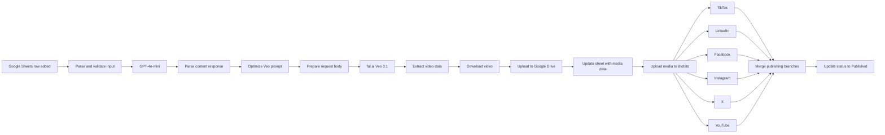

# AI Video Creation and Multi-Platform Publishing

An n8n workflow that turns a row in Google Sheets into an AI-generated vertical video, stores the result in Google Drive, and publishes it through Blotato to TikTok, LinkedIn, Facebook, Instagram, X, and YouTube.

The workflow export is available in [`auto_post_all.json`](auto_post_all.json).

Repository: [Content_Creation_AUtomation_Blotato](https://github.com/Ujuonong/Content_Creation_AUtomation_Blotato)

## What This Workflow Does

1. Watches the `Video_Requests` Google Sheet for new rows every 30 minutes.
2. Validates the requested niche, idea, and three reference-image URLs.
3. Uses GPT-4o-mini to create:
   - A cinematic Veo prompt of approximately 150-200 words.
   - A social caption of approximately 50-100 words.
   - Eight to ten hashtags.
4. Builds an 8-second, 9:16 Veo 3.1 reference-to-video request.
5. Sends the request to fal.ai and extracts the generated video URL.
6. Downloads the video and uploads it to a configured Google Drive folder.
7. Sends the hosted media URL to Blotato.
8. Publishes the media to six social platforms in parallel.
9. Waits for all publishing branches and updates the Google Sheet status to `Published`.

## Architecture



## Requirements

- An n8n instance with permission to install community nodes.
- An OpenAI API key with access to `gpt-4o-mini`.
- A fal.ai API key with access to `fal-ai/veo3.1/reference-to-video`.
- A Google account with access to Google Sheets and Google Drive.
- A Blotato account with connected social accounts and an API key.
- Three publicly reachable reference-image URLs for each video request. The video provider must be able to download them.

## Installation

### 1. Import the workflow

1. Open n8n.
2. Select **Workflows** and choose **Import from File**.
3. Select [`auto_post_all.json`](auto_post_all.json).
4. Save the imported workflow with a name appropriate for your n8n instance.

The exported workflow is inactive by default. Keep it inactive until credentials and test data have been configured.

### 2. Install the Blotato community node

In n8n, open **Settings -> Community Nodes**, install:

```text
@blotato/n8n-nodes-blotato
```

Restart n8n if the node does not appear after installation.

### 3. Configure credentials

Replace the placeholder credential references created by the export with credentials from your own n8n instance:

| Service | n8n credential | Used by |
| --- | --- | --- |
| OpenAI | OpenAI API | `GPT-4 API Call` |
| Google Sheets | Google Sheets OAuth2 | Trigger and sheet update nodes |
| Google Drive | Google Drive OAuth2 | `Google Drive Upload` |
| Blotato | Blotato API | Media upload and publishing nodes |

The export stores service values in the `Workflow Configuration` node. Replace these placeholders before running the workflow:

| Field | Value to provide |
| --- | --- |
| `openai_api_key` | Your OpenAI API key, if this field is used by your instance |
| `fal_api_key` | Your fal.ai key, including the required `key ` prefix if required by the endpoint |
| `google_drive_folder_id` | ID of the Google Drive destination folder |
| `google_sheet_id` | ID of the Google Sheet used for requests and tracking |
| `min_idea_length` | Minimum idea length configured in the workflow |
| `required_photos` | Number of required reference images; the current code expects exactly 3 |

Do not commit real API keys or OAuth tokens to Git. Prefer n8n credentials, environment variables, or a secret manager.

## Google Sheets Setup

Create a sheet named `Video_Requests`. The first row must contain these headers:

| Column | Header | Required input | Description |
| --- | --- | --- | --- |
| A | `id_video` | Yes | Unique identifier for the request |
| B | `niche` | Yes | Content category, such as fitness or technology |
| C | `idea` | Yes | Video concept; must be longer than 5 characters |
| D | `url_1` | Yes | First reference image URL |
| E | `url_2` | Yes | Second reference image URL |
| F | `url_3` | Yes | Third reference image URL |
| G | `url_final` | Initially empty | Final media URL or value written by the workflow |
| H | `status` | Optional | `pending`, `processing`, `completed`, `failed`, or `draft` |

Example test row:

| id_video | niche | idea | url_1 | url_2 | url_3 | url_final | status |
| --- | --- | --- | --- | --- | --- | --- | --- |
| TEST_001 | Health | Benefits of morning exercise | `https://...` | `https://...` | `https://...` |  | pending |

### Input validation

`Parse Sheet Input` rejects or reports errors for:

- A missing or short `niche`.
- An `idea` that is missing or six characters or shorter.
- Missing image URLs.
- Image URLs that do not start with `http`.
- An invalid `url_final` when one is already present.
- An unsupported status value.

Google Drive links in the format `drive.google.com/file/d/<FILE_ID>/...` are converted to direct download links before the Veo request. The files still need to be accessible to the external video service.

## Workflow Nodes

### Intake and content generation

- `Google Sheets Trigger`: detects added rows on a 30-minute polling interval.
- `Parse Sheet Input`: reads headers, trims values, validates required fields, and creates the `image_urls` array.
- `Workflow Configuration`: carries API and destination settings through the execution.
- `GPT-4 API Call`: asks `gpt-4o-mini` for structured prompt, caption, and hashtag data.
- `Parse GPT Response`: supports object responses and JSON-string responses, then normalizes hashtags with a leading `#`.
- `Optimize Prompt for Veo`: adds consistent-character, cinematic, duration, aspect-ratio, and frame-rate instructions.

### Video generation and storage

- `Prepare Veo Request Body`: validates the prompt and exactly three image URLs, then creates the request body.
- `Veo Generation1`: calls fal.ai with a 10-minute HTTP timeout.
- `Extract Video Data`: extracts the generated URL and metadata while preserving request and caption data.
- `Download Video`: downloads the generated media as a file.
- `Google Drive Upload`: stores the MP4 in the configured Drive folder.
- `Google Sheets Append`: updates the request record with generated media data.

### Publishing and tracking

- `Upload Video to BLOTATO`: uploads the final media URL to Blotato.
- `Tiktok`, `Linkedin`, `Facebook`, `Instagram`, `Twitter (X)`, and `Youtube`: publish the media using the generated caption.
- `Merge1`: waits for the six publishing branches.
- `Google Sheets Append1`: updates the matching `id_video` row to `Published`.

## Platform Configuration

The export contains Blotato account selections for each destination. After importing, verify that every account belongs to your own Blotato workspace:

| Node | Platform |
| --- | --- |
| `Tiktok` | TikTok |
| `Linkedin` | LinkedIn |
| `Facebook` | Facebook page |
| `Instagram` | Instagram |
| `Twitter (X)` | X/Twitter |
| `Youtube` | YouTube; title uses the idea and privacy is set to `private` |

Change account IDs, page IDs, captions, privacy, and other platform options in n8n before production use.

## Important Import Checks

The JSON export contains instance-specific cached IDs and placeholder values. Verify these settings after import:

1. Re-select the Google Sheet and worksheet in `Google Sheets Trigger`.
2. Re-select the destination Drive folder in `Google Drive Upload`.
3. Confirm the worksheet and column mapping in `Google Sheets Append` and `Google Sheets Append1`.
4. Confirm that the matching column in `Google Sheets Append1` is `id_video`.
5. Confirm that the Blotato media URL is the URL returned by the Drive or media-upload step.
6. Confirm all six Blotato account selections.
7. Confirm the `fal_api_key` header format expected by your fal.ai account.

The exported `Google Sheets Append` node has an empty sheet-name/mapping configuration in the JSON. It should be opened and completed in the n8n editor before testing.

## Testing Checklist

1. Import the workflow and configure every credential.
2. Verify the Google Sheet headers exactly match the schema above.
3. Use three small, publicly reachable test images.
4. Add one test row with `id_video: TEST_001` and `status: pending`.
5. Execute the workflow manually first, if your n8n setup allows it.
6. Check the execution after each stage: GPT, fal.ai, Drive, Blotato, and the final sheet update.
7. Confirm the video exists in Google Drive.
8. Confirm the six publishing nodes return successfully.
9. Confirm the matching row is updated to `Published`.
10. Switch the workflow to **Active** only after the test succeeds.

Video generation can take several minutes. The fal.ai request timeout is configured to 600,000 ms (10 minutes), and the trigger polls every 30 minutes.

## Troubleshooting

### The trigger does not run

- Confirm the workflow is active.
- Confirm the Google Sheets OAuth credential is connected.
- Confirm the selected document and worksheet are correct.
- Remember that the trigger polls every 30 minutes.

### The input parser fails

- Check header spelling and capitalization.
- Ensure `niche` is longer than two characters.
- Ensure `idea` is longer than five characters.
- Ensure all three image values are complete `http://` or `https://` URLs.

### Veo rejects the request

- Verify the fal.ai API key and authorization format.
- Confirm exactly three image URLs are present.
- Confirm the images are publicly downloadable.
- Check the n8n execution data for the generated `veo_request_body`.

### Drive or Sheets updates fail

- Reconnect the Google OAuth credentials.
- Confirm the account can write to the target folder and spreadsheet.
- Re-check the document ID, worksheet, matching column, and field mapping after import.

### Blotato publishing fails

- Confirm the community node is installed and enabled.
- Reconnect the Blotato API credential.
- Verify each platform account and Facebook page selection.
- Confirm the media upload returned a valid URL before the platform branches run.

## Estimated Cost

The estimates included in the workflow notes are approximately:

- OpenAI: `$0.01-$0.05` per video.
- fal.ai Veo 3.1: `$0.50-$2.00` per video, depending on current pricing and generation settings.
- Google and Blotato: depends on the plans and usage limits for your accounts.

These are only planning estimates. Check the providers' current pricing, quotas, and rate limits before production use.

## Security and Operations

- Keep API keys out of the workflow export and Git history.
- Restrict Google Drive folder and sheet permissions to the automation account.
- Review n8n execution logs because prompts, captions, URLs, and provider responses may contain sensitive data.
- Start with private or test publishing destinations.
- Add provider-specific retry and failure handling before high-volume production use.
- Monitor fal.ai, OpenAI, Google, and Blotato quotas.
- Back up the workflow export after meaningful configuration changes, while removing secrets first.

## Project Files

```text
.
├── auto_post_all.json   # n8n workflow export
└── README.md            # setup and operating documentation
```

## License

No license is currently specified for this repository. Add a license file before distributing the workflow publicly.